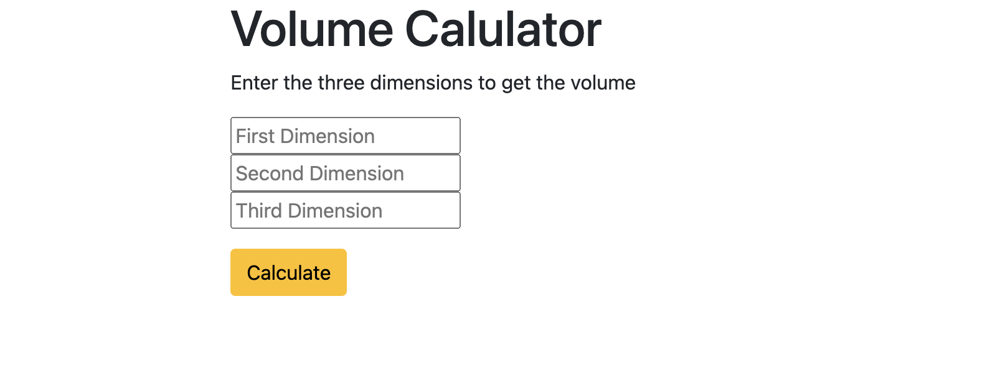

# Flask Volume Calculator 

A simple Flask web application that calculates the volume of a rectangular box given three dimensions (length, width, height).  
The app takes user input from a form, processes it with a POST request, and displays the calculated volume.
 

## Features
- Input three dimensions using a web form
- Calculates and displays the volume
- Handles both `GET` (load page) and `POST` (submit form) requests
- Uses Flask templates (`index.html`) for rendering

## Requirements
- Python 3.8+
- Flask

## Installation

1. Clone this repository or copy the files.
2. Install the required Python dependencies:
   ```bash
   pip install -r requirements.txt
   ```